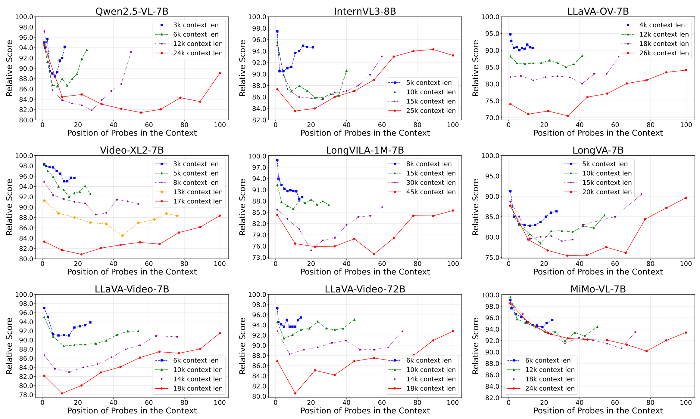

<h1 align="center"> Video-LevelGauge: Investigating Contextual Positional Bias in Large Video Language Models</h1>

<p align="center">

[](https://arxiv.org/abs/2508.19650)
[](https://huggingface.co/datasets/Cola-any/Video-LevelGauge)
[](https://github.com/Cola-any/Video-LevelGauge)

</p>


---
## 🔥 Updates
- Release the metric code. [Coming soon]
- Release the evaluation code. [Coming soon]
- **8/28/2025**: The data for the Video-LevelGauge has been released (🤗[Dataset](https://huggingface.co/datasets/Cola-any/Video-LevelGauge)).
- **8/27/2025**: We have release the paper (📖[arXiv Paper](http://arxiv.org/abs/2508.19650)).

## 🏆 Leaderboard

Gemini 2.5 Pro exhibits the least **positional bias** in the long video understanding task, followed by GLM-4.5V, GPT-4o-latest, Doubao-Seed-1.6, and other models. Higher scores correspond to a more pronounced bias.

<p align="center">
    
</p>

## 🏠 Introduction
🔔 Large Video Language Models (LVLMs) suffer from the **positional bias** problem: they understand the same content *inconsistently* when it appears in different places of long videos.
<p align="center">
    
</p>

🌟 The serial **position effect** in psychology suggests that humans tend to better recall content presented at the beginning and end of a sequence. Similar behaviors have been observed in language models. 

To date, how various types of LVLMs, such as those incorporating memory components or trained with long-context, perform on *positional biases* remains under-explored.
Besides, how positional bias manifests in video-text interleaved contexts is still an open question. In particular, models claiming to excel at long video understanding should be validated for their ability to maintain consistent and effective perception across the entire sequence, with minimal positional bias. For example, Qwen2.5-VL-7B exhibits reduced positional bias on the OCR task compared to its bias on other tasks:

<p align="center">
    
</p>

## 👀 Video-LevelGauge Overview
Video-LevelGauge is explicitly designed to investigate contextual positional bias in video understanding. We introduce a standardized probe and customized context design paradigm, where carefully designed probe segments are inserted at varying positions within customized contextual contents. By comparing model responses to identical probes at different insertion points, we assess positional bias in video comprehension.
It supports flexible control over context length, probe position, and context composition to evaluate positional biases in various real-world scenarios, such as **multi-video understanding, long video comprehension, and multi-modal interleaved inputs**.
Video-LevelGauge encompasses six categories of structured video understanding tasks (e.g., action reasoning), along with an open-ended descriptive task. It includes 438 manually collected multi-type videos, 1,177 multiple-choice question answering (MCQA) items, and 120 open-ended instructed descriptive problems paired with annotations.
<p align="center">
    
</p>

## 🔍 Dataset

### ✒️ License
Video-LevelGauge is under the CC-BY-NC-SA-4.0 license. 
It is derived from several previously published datasets ([VideoMME](https://huggingface.co/datasets/lmms-lab/Video-MME), [MLVU](https://huggingface.co/datasets/MLVU/MVLU), [VisDrone](https://github.com/VisDrone/VisDrone-Dataset), [UCF-Crime](https://www.crcv.ucf.edu/projects/real-world/), and [Ego4D](https://github.com/facebookresearch/Ego4d)). Please note that the original datasets may have their own licenses. Users must comply with the licenses of the original datasets when using this derived dataset.

⚠️ If you access and use our dataset, you must understand and agree: **Video-LevelGauge is only used for academic research. Commercial use in any form is prohibited. The user assumes all effects arising from any other use and dissemination.**

We do not own the copyright of any raw video files and the copyright of all videos belongs to the video owners. Currently, we provide video access to researchers under the condition of acknowledging the above license. For the video data used, we respect and acknowledge any copyrights of the video authors. 
If there is any infringement in our dataset, please email overwhelmed@mail.ustc.edu.cn and we will remove it immediately.

🌟 The annotation file and the raw videos are readily accessible via this [HF Link](https://huggingface.co/datasets/Cola-any/Video-LevelGauge) 🤗. Note that this dataset is for research purposes only and you must strictly comply with the above License.

## 🔮 Evaluation PipLine
Coming soon.

## 📈 Experimental Results
📍**Evaluation results of Stat-of-the-art LVLMs.**

We conduct a comprehensive investigation of 27 LVLMs using Video-LevelGauge, including 6 commercial models, i.e., Gemini 2.5 Pro and QVQ-Max; 21 open-source LVLMs covering unified models like InternVL3, long video models like Video-XL2, specific optimized models like VideoRefer, multi-modal reasoning models like GLM-4.5V, and two-stage methods like LLoVi.
<p align="center">
    
</p>

📍**Effect of Context Length on Positional Bias.**

Positional bias is prevalent across various context lengths and tends to intensify as the context length increases, accompanied by shifts in bias patterns.
<p align="center">
    
</p>

📍**Effect of Context Type on Positional Bias.**

LVLMs exhibit more pronounced positional bias in complex context scenarios.
<p align="center">
    
</p>

📍**Effect of Model Size on Positional Bias.**

Positional bias is significantly alleviated as model size increases, consistent with scaling law observed in other capabilities.
<p align="center">
    
</p>

📍**Effect of Thinking Mode on Positional Bias.**

Thinking mode can alleviate the positional bias issue to a certain extent.
<p align="center">
    
</p>

## Citation
If you find our work helpful for your research, please consider giving a star 🌟 and citation.  
```
@article{xia2025videolevelgaugeinvestigatingcontextualpositional,
  title   = {Video-LevelGauge: Investigating Contextual Positional Bias in Large Video Language Models},
  author  = {Hou, Xia and Fu, Zheren and Ling, Fangcan and Li, Jiajun and Tu, Yi and Mao, Zhendong and Zhang, Yongdong},
  journal = {arXiv preprint arXiv:2508.19650},
  year    = {2025},
}
```
